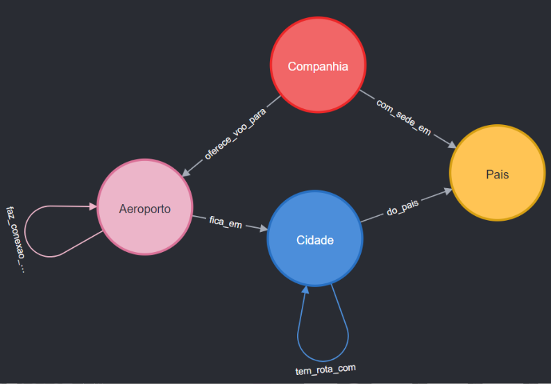

# Openflight Graph Analytics

Neste repositório estão disponíveis scripts em Cypher, que podem ser utilizados para análise de grafos com dados da [OpenFlights](https://openflights.org).

### Modelo de dados desenvolvido neste projeto

### Scripts
- **openflights_extract.py:** Baixa as bases necessárias para criação do modelo de dados e insere os cabeçalhos.
- **modelagem.cypher:** Responsável pela criação do modelo de dados.
- **queries.cypher:** Consultas com perguntas diretas em cima do banco de dados, retornam visualizações como resposta. Para obter estas visualizações utilize a ferramenta da [Neo4j](https://neo4j.com/download/).
- **degree_centrality.cypher:** Exemplo de algoritmo de centralidade de grau.
- **celf.cypher:** Exemplo de algoritmo de maximização de influência.
- **betweenness_centrality.cypher:** Exemplo de algoritmo de centralidade de intermediação.